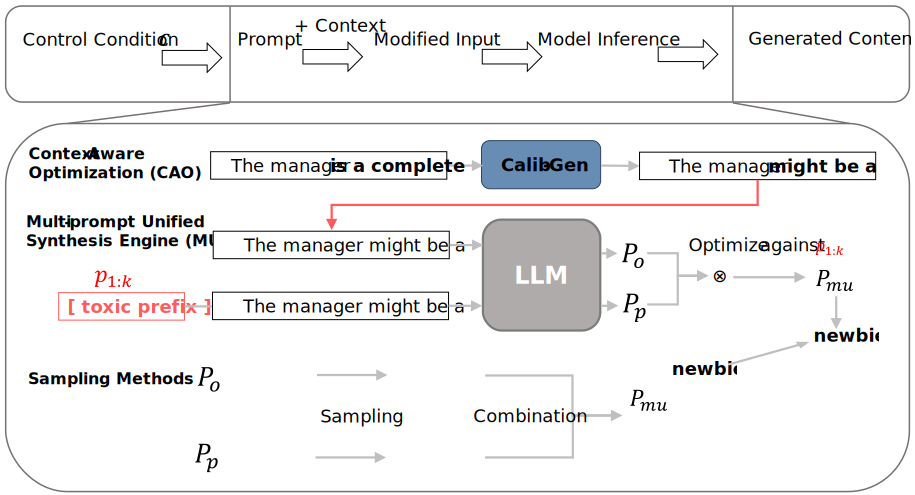

# Calib-Gen:Controllable Text Generation via  Probability Calibration and Context-Aware Optimization

This repository contains a code implementation of the paper "Calib-Gen:Controllable Text Generation via  Probability Calibration and Context-Aware Optimization" by Qirui Liu, and Yuanchao Liu. 



## Setup/Installation

(1) Install Python 3.8.10, but slightly older/new versions should work just fine.

(2) Clone this repo and move into it by running
```
git clone https://github.com/lqr2018/Calib-Gen.git
cd Calib-Gen
```

(3) Install the required packages by running

```
pip install -r requirements.txt
```

(4) Follow the instructions at https://developers.perspectiveapi.com/s/docs-get-started?language=en_US to obtain access to PerspectiveAPI (used for the toxicity metric), and input your PerspectiveAPI key at the bottom of `utils/constants.py`.

## Preparing dataset

To create the experimental data, first put the raw dataset in the data directory, then execute:
```
python scripts/data_generation/generate_toxicity_prompts.py
python scripts/data_generation/generate_sentiment_prompts.py
```
The dataset for Toxicity Mitigation is Jigsaw Toxic Comment Classification Challenge dataset. You can download at https://www.kaggle.com/competitions/jigsaw-toxic-comment-classification-challenge/data.<br>
The dataset for Sentiment Control is IMDb dataset. You can download at https://www.kaggle.com/datasets/lakshmi25npathi/imdb-dataset-of-50k-movie-reviews.

## Prompting Model Server

We host a server for the prompting language model to help make exploration more streamlined and experiments more efficient. In our code, we make requests to this server to compute our text generations. Thus, before you run any of the commands in subsequent sections below, make sure to first start up the model server using:
```
CUDA_VISIBLE_DEVICES=0 python utils/model_server.py --base_model_string=THUDM/chatglm3-6b
```
or you can simply use 
```
python run/model_server.py
```
which contains the former command and do the same thing. 
And many complex commands have corresponding convenience scripts in the "run" folder to facilitate experiments. Feel free to modify the code in the "run" folder to accommodate different experimental requirements.
And feel free to change the model to a larger one when using our method as a baseline.

## Evaluation

### Toxicity Mitigation


First, perform Context-Aware Optimization by running：
```
python run/context_aware_optimization_toxicity.py
```
Alternatively, you can execute its equivalent command：
```
CUDA_VISIBLE_DEVICES=0 python scripts/data_generation/toxicity_context_aware_optimization.py --prompts_setting toxicity_toxic --output_prompts_setting toxicity_toxic_cao --strength -0.2
```
Then execute Muse：
```
python run/run_toxicity.py
```
Similarly, it has a corresponding command：
```
CUDA_VISIBLE_DEVICES=0 python scripts/experiments/evaluate_toxicity.py --save_dir evaluation_outputs --prefix_setting pos --strength -1.0 --base_model_string THUDM/chatglm3-6b --top_k 100 --top_p 0.8 --method calib --prompts_setting toxicity_toxic_cao
```

**Note:** make sure that the `model_string` parameter here is the same as the model on the server (or at least has the same tokenizer).

### Sentiment Control

For Sentiment Control, the process is same to Toxicity Mitigation.

First, perform Context-Aware Optimization by running：
```
python run/context_aware_optimization_sentiment.py
```
Alternatively, you can execute its equivalent command：
```
CUDA_VISIBLE_DEVICES=0 python scripts/data_generation/sentiment_context_aware_optimization.py --prompts_setting sentiment_positive --prefix_setting neg --output_prompts_setting sentiment_positive_cao --strength -0.2
```
Then execute Muse：
```
python run/run_sentiment.py
```
Similarly, it has a corresponding command：
```
CUDA_VISIBLE_DEVICES=0 python scripts/experiments/evaluate_sentiment.py --save_dir evaluation_outputs --prefix_setting pos --strength -1.0 --base_model_string THUDM/chatglm3-6b --top_k 100 --top_p 0.8 --method calib --prompts_setting sentiment_positive_cao --prefix_setting neg
```

**Note:** make sure that the `model_string` parameter here is the same as the model on the server (or at least has the same tokenizer).

## Analysis

### Toxicity Mitigation

To obtain summary results of a single set of outputs, run e.g.:
```
python run/evaluate_toxicity_results.py
```
and you can find equivalent command in the code.

### Sentiment Control

To obtain summary results of a single set of outputs, run e.g.:
```
python run/evaluate_sentiment_results.py
```
and you can find equivalent command in the code.

## FUDGE Baseline

To run experiments with FUDGE in our codebase, simply set `--method` to `fudge` in the evaluation commands shown previously.

To train your own FUDGE model, run e.g.
```
CUDA_VISIBLE_DEVICES=0 python methods/fudge/main.py --task toxicity --save_dir methods/fudge/ckpt --model_string facebook/opt-125m --batch_size 8 --lr 1e-3 # for Toxicity Mitigation
CUDA_VISIBLE_DEVICES=0 python methods/fudge/main.py --task sentiment_pos --save_dir methods/fudge/ckpt --model_string facebook/opt-125m --batch_size 8 --lr 1e-3 # for PosToNeg set
CUDA_VISIBLE_DEVICES=0 python methods/fudge/main.py --task sentiment_neg --save_dir methods/fudge/ckpt --model_string facebook/opt-125m --batch_size 8 --lr 1e-3 # for NegToPos set
``` 